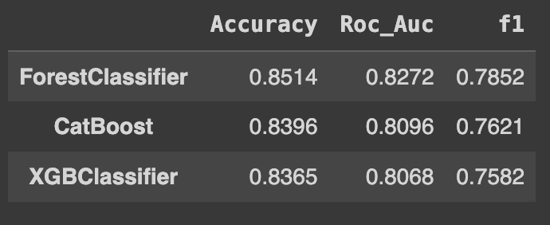

# Предсказание отмены брони отелей

## Краткое описание проекта

Модель на основании данных о посетителе предсказывает, будет ли отменена бронь.

Этапы работы:

- Обработка пропусков
- Удаление выбросов
- Анализ значимости признаков и удаление наименее значимых
- Сравнительная характеристика методов обучения

## Авторы

Юрченко Анна - обработка данных/код
Никитин Григорий - обработка данных/код
Ибрагимов Данииль - сравнительная характеристика методов

## Результаты

